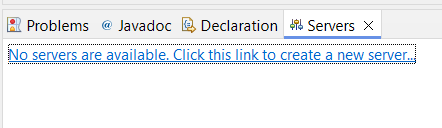
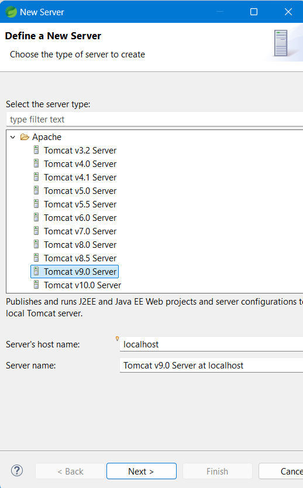
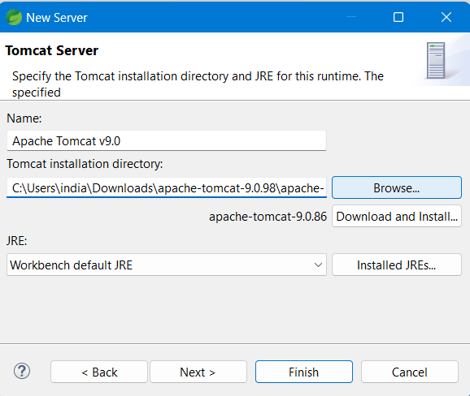

# Adding Apache Tomcat Server 9 in Spring Tool Suite 4

## Prerequisites
- Download and install [Spring Tool Suite 4](https://spring.io/tools)

## Download and extract Apache Tomcat 9.0.98
1. Download the Apache Tomcat 9.0.98 zip file from the below link.
    - Download [Apache Tomcat 9](http://tomcat.apache.org/download-90.cgi)
    - Direct Download Link [Apache Tomcat 9.0.98 Direct Download Link](https://dlcdn.apache.org/tomcat/tomcat-9/v9.0.98/bin/apache-tomcat-9.0.98.zip)
2. Extract the downloaded zip file to a directory of your choice.
    - Example: My Extracted directory is `C:\Users\india\Downloads\apache-tomcat-9.0.98\apache-tomcat-9.0.98`

## Steps to Add Apache Tomcat Server 9 in STS 4

### Step 1: Open Spring Tool Suite 4
- Launch the Spring Tool Suite 4 application.
- Choose or enter your workspace.
- Note: Server in STS are added as workspace specific. if workspace is changed you need to again add the server.

### Step 2: Open the Servers View
1. Go to `Window` > `Show View` > `Other...`
2. In the `Show View` dialog, expand `Server` and select `Servers`. Click `Open`.

### Step 3: Add a New Server
1. In the Servers view, right-click and select `New` > `Server`.
    - Or you can also click on: `No Server are available. Click this link to create a new server..`
2. In the `New Server` dialog, expand `Apache` and select `Tomcat v9.0 Server`. Click `Next`.
    - 

### Step 4: Configure the Tomcat Server
1. Click `Browse...` and navigate to the directory where you extracted Apache Tomcat 9.
2. Select the `Tomcat 9` installation directory and click `Finish`.
    - Or you can directly copy paste in  Tomcat installation directory: For my case `C:\Users\india\Downloads\apache-tomcat-9.0.98\apache-tomcat-9.0.98`
    - 
    - 
3. Click Finish here.

### Step 5: To Start the Server
1. In the Servers view, right-click on the newly added Tomcat server and select `Start`.
2. The server will start, and you can see the status in the Console view.
